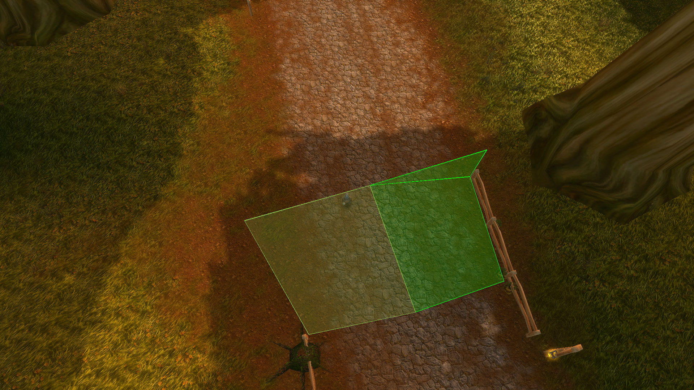
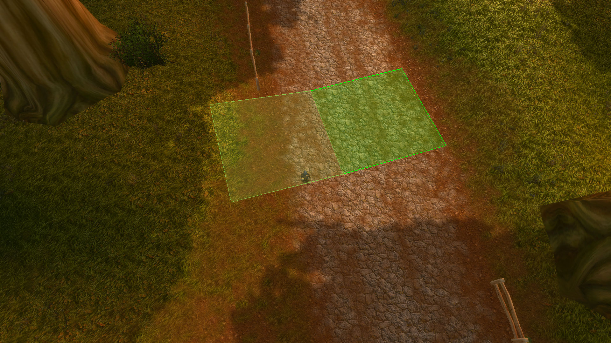
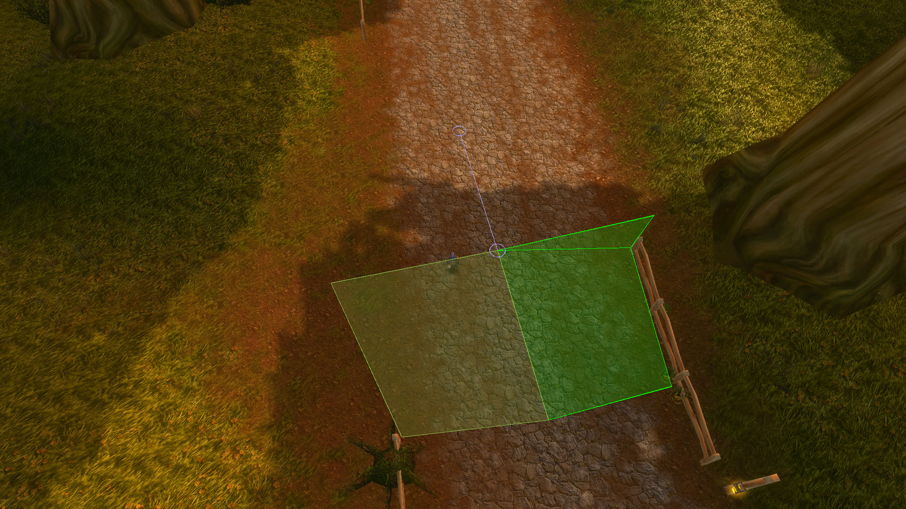
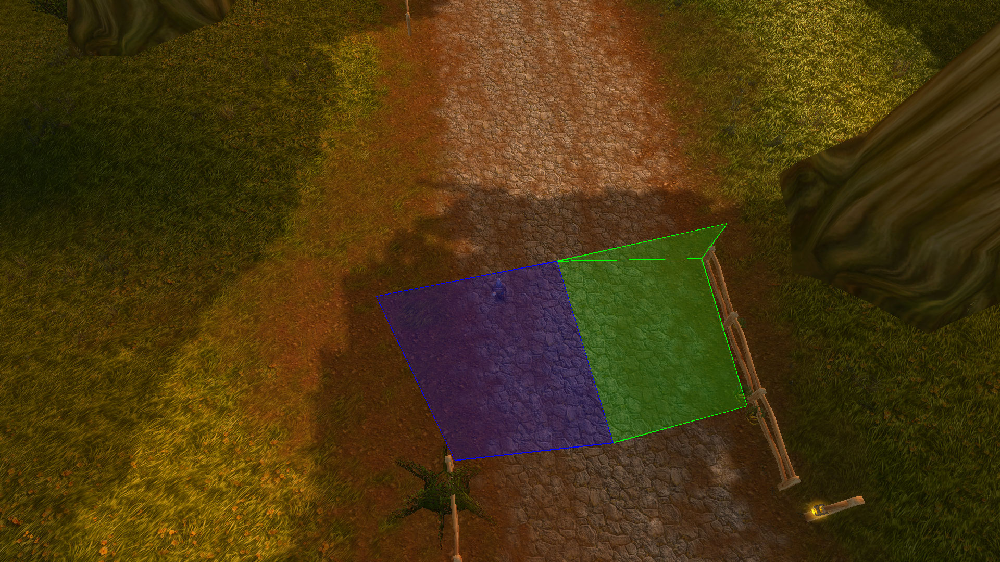
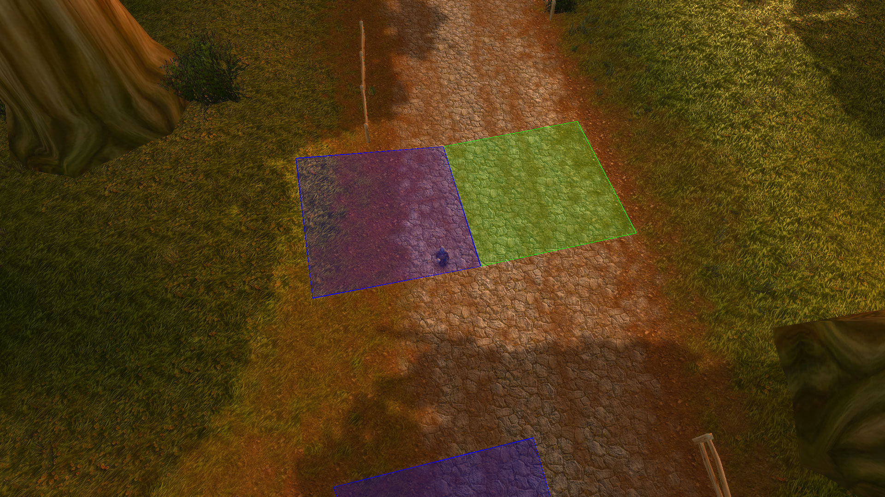

# Improving the mesh net

Sometimes there seems to be disconnects between mesh polygons.
This seems usually the case when the pathfinding system seems to fail to find a path.

## How to fix polygon disconnects

### Visualizing the mesh net

This can be done with the [MeshNet](https://github.com/AkiKonani/Bot/tree/3dccd84d783a48520b4e4b5facff8ea0b490cf07/AddOns/Bot) add-on. Please see [installation instructions](https://github.com/AkiKonani/Bot/blob/3dccd84d783a48520b4e4b5facff8ea0b490cf07/README.md#installation).

```
/script MeshNet.toggleMeshVisualization()
```

(a macro with this command can also be created and bound to a key ;-))

### Identifying disconnects



The mesh polygons are visualized with green lines.

Polygons that are connected with the polygon, that the character stands in, are shown.

A neighboring polygon which seems disconnected from the polygon from the previous image:



After the polygons have been connected:



### Connecting polygons

Given two polygons to connect.

1. Move the character to a position inside the first polygon.
2. Run `/script MeshNet.setFirstOffMeshConnectionPolygon()`
3. Move the character to a position inside the second polygon.
4. Run `/script MeshNet.setSecondOffMeshConnectionPolygon()`
5. Save the connection. There are two options available:
   * For bidirectional connections: `/script MeshNet.connectPolygons(true)`
   * For one-way connections (from the first polygon to the second polygon): `/script MeshNet.connectPolygons(false)`

The connections are saved into the file `AddOns/MeshNet/OffMeshConnectionsDatabase.lua`.

#### How it looks

Step 1 and 2:



Step 3 and 4:



Step 5:


### Removing a connection

The connection with the closest `from` or `to` point, which is highlighted in a brighter blue, can be removed with `/script MeshNet.removeClosestOffMeshConnection()`.
